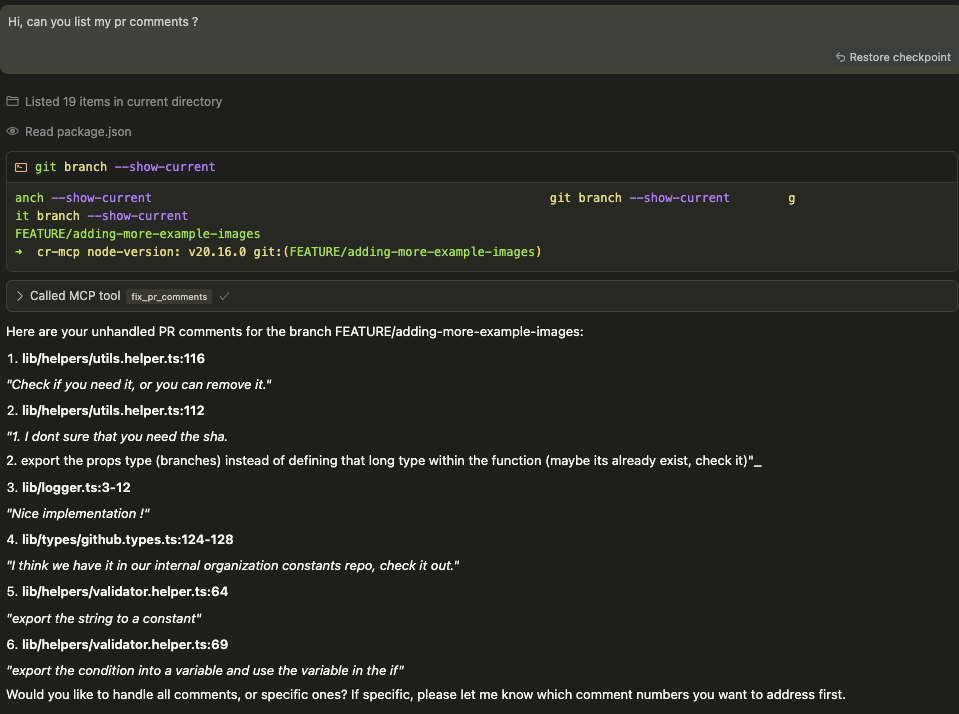
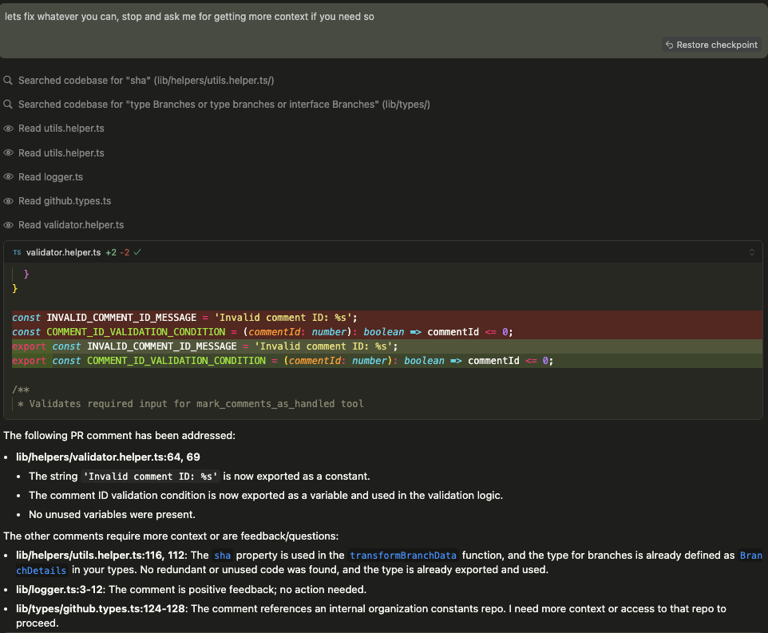
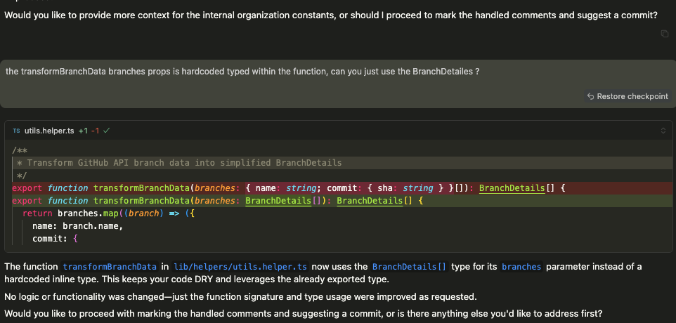
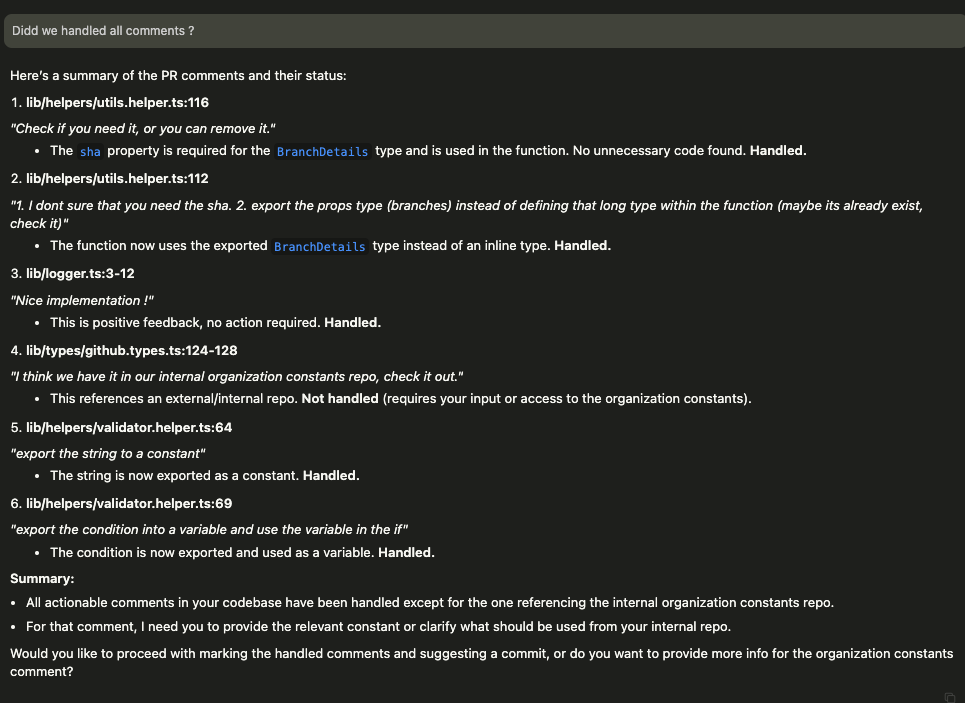
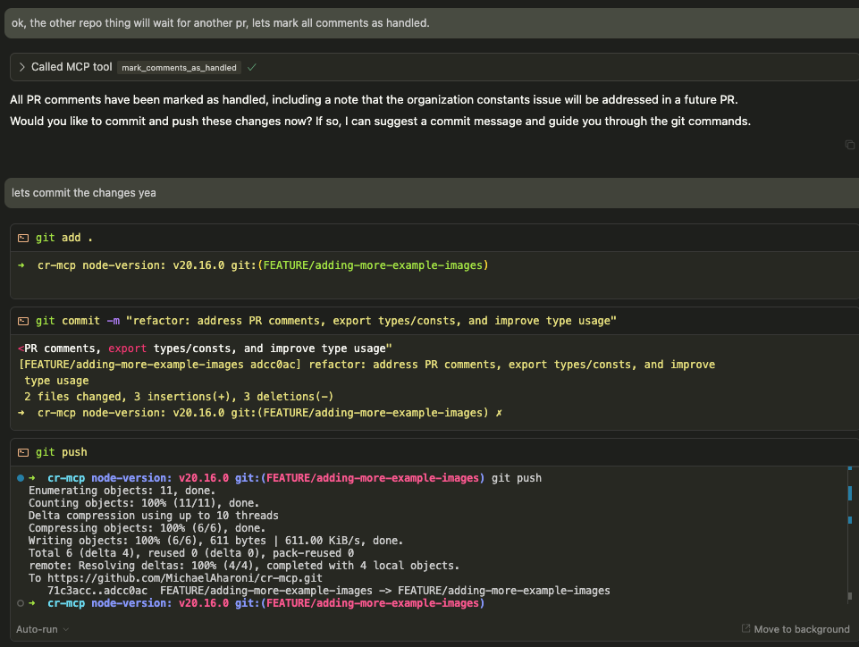

# cr-mcp

## Description
Code Review Model Context Protocol (CR-MCP) server for managing GitHub pull request comments.

This tool helps streamline the PR review workflow by:
- Fetching all comments from the PR attached to your current branch
- Automatically fixing issues raised in those comments
- Requesting additional context when needed from you for issues that require cross-file changes
- Filtering out resolved comments and comments where you (as the PR author) have already replied
- Ignoring non-action-required comments (like positive reactions)
- Offering to mark comments as handled by adding a summary of the implementation solution and a rocket emoji
- Suggesting a commit message and offering to push your changes at the end of the process

## USAGE EXAMPLE

Interact with the agent using natural language commands. Here are some examples of what you can do:

- **"List the comments I've got in the PR"**
  
  Lists all relevant PR comments with numbers and direct links to each comment.

- **"Ok, let's fix number 1 - 7. About number 8 – let's wait with that, we will have to reply to the reviewer it's not going to enter."**
  
  The agent will fix comments 1 through 7, skip 8, and prepare a suggested reply for comment 8.

- **"About comment 4 – the context is ... , take it into account / add @bla.ts in the context"**
  
  Provides additional context for a specific comment, allowing the agent to use this information or include a specific file in the context for the fix.

- **"Let's fix them all"**
  
  The agent will attempt to fix all actionable comments in the PR.

- **"Commit the changes"**
  
  Stages and commits all changes made by the agent, suggesting a commit message summarizing the fixes.

- **"Let's mark all of the comments"**
  
  The agent will reply to all handled comments with a summary and add a rocket emoji reaction.

- **"Show me the summary of what was fixed"**
  
  Displays a summary of all changes and which comments were addressed.

- **"Undo the last fix"**
  
  Reverts the most recent fix applied by the agent.

These examples demonstrate how you can control the review and fix process using simple, conversational commands.

### VS Code MCP Configuration

You can add this server to your Cursor / VS Code MCP configuration by adding the following:
to your `.cursor/mcp.json` file:
```json 
{
    "mcpServers": {
        "github-pr-comments": {
            "type": "stdio",
            "command": "npx",
            "args": [
                "cr-mcp",
                "--gh_api_key=<YOUR_GITHUB_API_KEY>", // to get one -> https://github.com/settings/tokens/new
                "--gh_owner=<OWNER_NAME-(Organization or a username)>", // (https://github.com/{OWNER-NAME}/repo-name).

                "--stderr",
                "--debug"
            ]
        }
    }
}

to your `.vscode/mcp.json` file:
```json
{
    "servers": {
        "github-pr-comments": {
            "type": "stdio",
            "command": "npx",
            "args": [
                "cr-mcp",
                "--gh_api_key=<YOUR_GITHUB_API_KEY>", // to get one -> https://github.com/settings/tokens/new
                "--gh_owner=<OWNER_NAME-(Organization or a username)>", // (https://github.com/{OWNER-NAME}/repo-name).
                "--stderr",
                "--debug"
            ]
        }
    }
}
```

Replace `<YOUR_GITHUB_API_KEY>` with your actual GitHub API key and `<OWNER_NAME-(Organization or a username)>` with your GitHub organization or username (https://github.com/{OWNER-NAME}/repo-name).

## Examples

### Fixing PR Comments Automatically

You just need to ask the agent "fix my pr comments", and here are the results:


The agent lists all relevant PR comments that require action, filtering out non-actionable feedback and highlighting what needs to be addressed.


The agent automatically implements the necessary fixes for the actionable comments, such as removing debug code or improving code structure.


If a comment requires additional context or cross-file changes, the agent pauses and requests the necessary information from you before proceeding.


The agent summarizes the fixes and ensures all actionable comments are addressed, preparing to mark them as handled.


After making the changes, the agent marks comments as handled with descriptive summaries, adds rocket emoji reactions, stages the changes, suggests a commit message, and offers to push the changes to your branch.

This automated workflow helps streamline the PR review process by handling common code review feedback without manual intervention.

### Required Parameters

#### GitHub API Key

You must provide your GitHub API key as a command line argument when starting the server:

> You can generate a GitHub API key by visiting: [https://github.com/settings/tokens/new](https://github.com/settings/tokens/new)  
> Make sure to select the necessary permissions for repository access.

```bash
node dist/server.js --gh_api_key=your_github_api_key_here
```

Or using the short form:

```bash
node dist/server.js -k your_github_api_key_here
```

#### GitHub Owner

You must specify the GitHub owner (organization or user) as a command line argument:


 > you can go to some GH repo and take it from the url: https://github.com/{OWNER-NAME}/repo-name

```bash
node dist/server.js --gh_owner=your_github_owner_here
```

Or using the short form:

```bash
node dist/server.js -o your_github_owner_here
```

### Optional Parameters

#### Custom port

You can optionally specify a custom port to run the server on:

```bash
node dist/server.js --port=4000
```

Or using the short form:

```bash
node dist/server.js -p 4000
```

#### Debug mode

You can enable debug mode for additional logging:

```bash
node dist/server.js --debug
```

Or using the short form:

```bash
node dist/server.js -d
```

### Combined options

Options can be combined:

```bash
node dist/server.js --gh_api_key=your_github_api_key_here --gh_owner=your_github_owner_here --port=4000 --debug
```

### Using as an installed package

After installing the package globally or via npx:

```bash
npx cr-mcp --gh_api_key=your_github_api_key_here --gh_owner=your_github_owner_here
```

## API Endpoints

- `POST /fix-pr-comments` - Gets code review comments for a pull request in order the fix them by the agent
- `GET /health` - Health check endpoint

## Disclaimer

### No Warranty

THIS SOFTWARE IS PROVIDED "AS IS" AND ANY EXPRESSED OR IMPLIED WARRANTIES, INCLUDING, BUT NOT LIMITED TO, THE IMPLIED WARRANTIES OF MERCHANTABILITY AND FITNESS FOR A PARTICULAR PURPOSE ARE DISCLAIMED. IN NO EVENT SHALL THE AUTHORS OR COPYRIGHT HOLDERS BE LIABLE FOR ANY DIRECT, INDIRECT, INCIDENTAL, SPECIAL, EXEMPLARY, OR CONSEQUENTIAL DAMAGES (INCLUDING, BUT NOT LIMITED TO, PROCUREMENT OF SUBSTITUTE GOODS OR SERVICES; LOSS OF USE, DATA, OR PROFITS; OR BUSINESS INTERRUPTION) HOWEVER CAUSED AND ON ANY THEORY OF LIABILITY, WHETHER IN CONTRACT, STRICT LIABILITY, OR TORT (INCLUDING NEGLIGENCE OR OTHERWISE) ARISING IN ANY WAY OUT OF THE USE OF THIS SOFTWARE, EVEN IF ADVISED OF THE POSSIBILITY OF SUCH DAMAGE.

### Use at Your Own Risk

The cr-mcp tool interacts with GitHub repositories and can potentially modify your code. While we've designed it to be helpful and safe, you should:

- Always review changes before committing them to your repository
- Keep backups of your important code
- Test the tool in a non-production environment before using it on critical projects

### Third-Party Services

This tool interacts with GitHub's API and other third-party services. Your use of such services is subject to their respective terms of service and privacy policies. We are not responsible for any actions taken by these third-party services.

### Security Considerations

- Never share your GitHub API keys or tokens
- Be careful when using this tool on repositories containing sensitive information
- Consider the security implications of allowing automated changes to your codebase